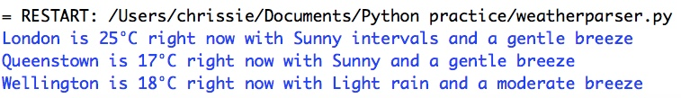

# parsinghtml-weather_finder
Parsing the BBC weather site to find up to date weather for a few places I have lived by, firstly, finding the place's current temperature and then finding a brief summary of the current conditions.

One downside to this code is that it occassionally will not work if the css selector is slightly altered.

